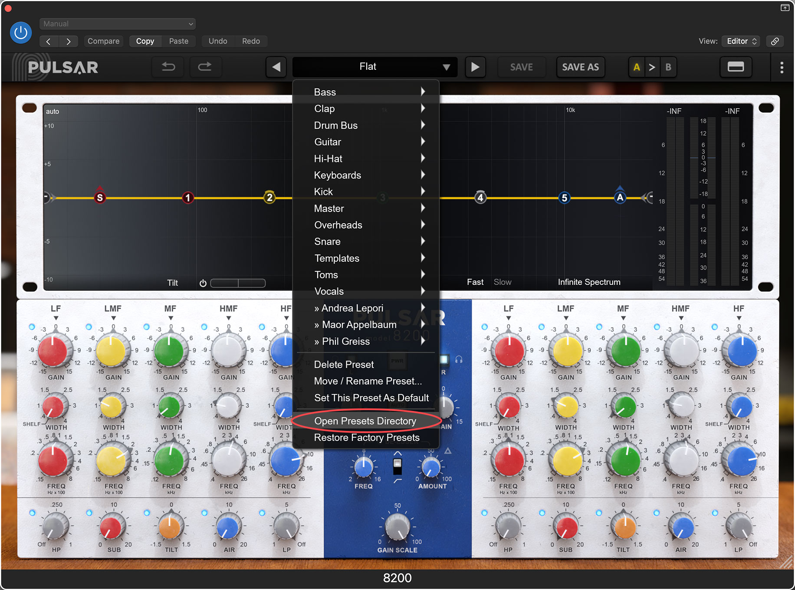
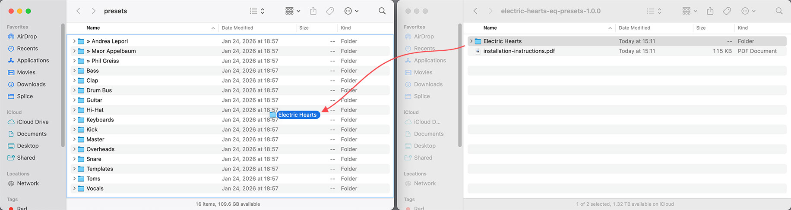

# Electric Hearts EQ Presets
For [Pulsar 8200](https://pulsar.audio/eq-8200/) - compatible with Mac and Windows

## Download and installation instructions
1. Download the latest version from the releases page and unzip it.
   
2. Open the 8200 plugin in your DAW, open the presets browser, click Open Presets Directory. **Leave this window open**. Close your DAW.

3. Drag and drop the **Electric Hearts** folder from the downloaded ZIP file to the Presets Directory folder you opened in step 1.

4. Reopen your DAW and the 8200 plugin. You should now see Electric Hearts listed in the plugin’s preset browser.
